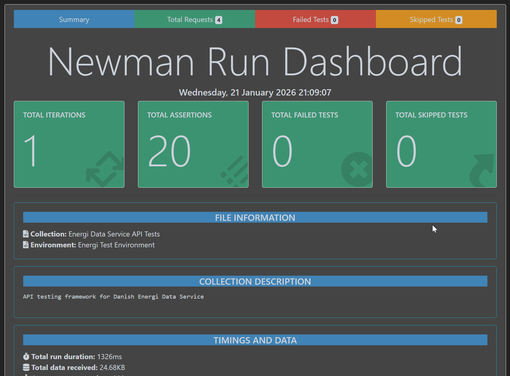

# Energi Data Service API Testing Framework

[](https://github.com/Trittton/energi-api-postman-newman-framework/actions)
[](https://opensource.org/licenses/ISC)
[](https://www.npmjs.com/package/newman)
[](https://trittton.github.io/energi-api-postman-newman-framework/report.html)

Production-grade API testing framework for the Danish Energi Data Service using **Postman + Newman**.

## 📊 Live Test Report

View the latest automated test results: [**Live Report →**](https://trittton.github.io/energi-api-postman-newman-framework/report.html)

*Reports auto-update on every main branch push*

---

## Overview

This framework validates two datasets from the [Energi Data Service API](https://api.energidataservice.dk/dataset/):
- **Elspotprices**: Electricity spot prices across Danish bidding zones (DK1, DK2, DE, NO2, SE3, SE4)
- **CO2Emis**: 5-minute CO2 emission data (DK1, DK2)

### Features
- Contract validation using JSON Schema
- Data-driven testing via CSV files
- Boundary, negative, and filter testing
- CI/CD integration with GitHub Actions
- Rich HTML reports with newman-reporter-htmlextra
- Environment-based configuration
- Modular collection design (DRY principles)

## 🎯 Test Metrics

- **20 Assertions** across 4 test requests
- **100% Pass Rate** on latest run
- **Response Time SLA**: < 5000ms
- **Automated Execution**: Daily at 6 AM UTC + on every PR
- **Coverage**: 2 datasets (Elspotprices, CO2Emis), 5 test scenarios

## 🛠 Technology Stack

- **Test Runner**: Newman 6.2.1
- **Reporter**: newman-reporter-htmlextra 1.23.1
- **CI/CD**: GitHub Actions
- **Hosting**: GitHub Pages
- **Validation**: JSON Schema Draft 07
- **Data-Driven**: CSV iteration

---

## Prerequisites

- **Node.js** 18+ (20 LTS recommended)
- **npm** 9+
- **Postman** (optional, for collection editing)

---

## Installation

1. Clone the repository:
   ```bash
   git clone https://github.com/Trittton/energi-api-postman-newman-framework.git
   cd energi-api-postman-newman-framework
   ```

2. Install dependencies:
   ```bash
   npm install
   ```

3. Verify installation:
   ```bash
   npm run test:api
   ```

---

## Repository Structure

```
/postman
  /collections          # Postman collections
  /environments         # Environment configurations
  /data                 # CSV files for data-driven tests
  /schemas              # JSON schemas for contract validation
/scripts               # Newman runner scripts
/reports/newman        # Generated HTML reports (gitignored)
/.github/workflows     # CI/CD pipeline
```

---

## Usage

### Run All Tests
```bash
npm run test:api
```

### Run Data-Driven Tests
```bash
# Elspotprices with CSV data
npm run test:api:elspot:ddt

# CO2Emis with CSV data
npm run test:api:co2:ddt
```

### Run Negative Tests Only
```bash
npm run test:api:negative
```

### Run All Test Suites
```bash
npm run test:all
```

### Custom Newman Execution
```bash
newman run postman/collections/EnergiDataService.postman_collection.json \
  -e postman/environments/energi.test.postman_environment.json \
  --folder "01_Elspotprices" \
  --reporters cli,htmlextra \
  --reporter-htmlextra-export reports/newman/custom-report.html
```

---

## Test Coverage

| Test ID | Category   | Description |
|---------|------------|-------------|
| TC-01   | Functional | Get records by date range (200 OK) |
| TC-02   | Contract   | JSON Schema validation (Elspotprices & CO2Emis) |
| TC-03   | Boundary   | Limit boundaries (limit=1, limit=100) |
| TC-04   | Negative   | Invalid start date format (400 error) |
| TC-05   | Filter     | PriceArea filtering (DK1/DK2) |

### Additional Tests
- Column selection validation
- DK1 vs DK2 filter comparison
- High-frequency data validation (5-min intervals)
- Extreme limit boundary testing
- Invalid filter syntax handling

---

## Reports

After running tests, HTML reports are generated in:
```
reports/newman/report.html
```

Open in browser to view:
- Request/response details
- Test results
- Response times
- Failure logs

**CI Reports:** Available as artifacts in GitHub Actions workflow runs.

### 📸 Report Preview

The HTML reports provide rich visualizations of test execution:



---

## Adding New Tests

### 1. Add Request to Collection
- Open [postman/collections/EnergiDataService.postman_collection.json](postman/collections/EnergiDataService.postman_collection.json) in Postman
- Add request to appropriate folder (e.g., `01_Elspotprices`)
- Use environment variables for URLs: `{{baseUrl}}{{datasetPath}}/Elspotprices`

### 2. Write Tests
Use collection-level utilities:
```javascript
validateBasicResponse(200);

const schema = loadSchema("elspotprices");
pm.test("Schema validation", () => {
    pm.response.to.have.jsonSchema(schema);
});
```

### 3. Add Data-Driven Cases (Optional)
Edit [postman/data/elspotprices_cases.csv](postman/data/elspotprices_cases.csv):
```csv
caseName,start,end,limit,filter,expectedStatus
New Test Case,2026-01-20T00:00:00,2026-01-20T12:00:00,50,,200
```

### 4. Export Collection
File → Export → Collection v2.1 → Save to `postman/collections/`

---

## CI/CD

Tests run automatically on:
- Every push to `main` or `develop`
- Every pull request
- Daily at 6 AM UTC (scheduled health check)
- Manual trigger via workflow_dispatch

**Manual trigger:** Go to Actions → API Tests → Run workflow

### GitHub Pages

Test reports are automatically published to GitHub Pages on the `main` branch:
- URL: `https://<username>.github.io/<repo-name>/report.html`
- Reports are updated on every main branch push

---

## Environment Variables

See [.env.example](.env.example) for available configuration options.

Key variables (set in [postman/environments/energi.test.postman_environment.json](postman/environments/energi.test.postman_environment.json)):
- `baseUrl`: https://api.energidataservice.dk
- `datasetPath`: /dataset
- `defaultLimit`: 100
- `defaultPriceArea`: DK1

---

## Troubleshooting

### Tests fail with timeout errors
Increase timeout in [package.json](package.json):
```bash
newman run ... --timeout-request 60000
```

### Schema validation fails
Verify schema in `postman/schemas/` matches API response structure.

### CSV iteration data not working
Ensure CSV headers match `pm.iterationData.get("columnName")` in tests.

### Reports not generating
Ensure `reports/newman/` directory exists:
```bash
mkdir -p reports/newman
```

---

## Contributing

1. Create feature branch: `git checkout -b feature/new-test`
2. Add tests following existing patterns
3. Run tests locally: `npm run test:all`
4. Commit and push
5. Open pull request

---

## License

ISC

---

## References

- [Energi Data Service API Documentation](https://api.energidataservice.dk/dataset/)
- [Newman Documentation](https://github.com/postmanlabs/newman)
- [newman-reporter-htmlextra](https://www.npmjs.com/package/newman-reporter-htmlextra)
- [Postman Learning Center](https://learning.postman.com/)
- [Technical Task Document](energi-postman-newman-technical-task.md)

---

## Project Structure Details

### Collection Architecture

The Postman collection follows a modular design with collection-level utilities:

**Collection-level Pre-request Script:**
- Date utility functions (`getISODateString`, `setDateRangeLast24Hours`)
- Automatic date range generation for non-data-driven runs
- Environment variable setup

**Collection-level Test Script:**
- Embedded JSON schemas (elspotprices, co2emis)
- Shared validation functions (`validateBasicResponse`, `validateFilterResults`)
- Failure-only logging utilities
- Schema loading function

**Folder Structure:**
```
00_PreRequest/     # Health checks and pre-request helpers
01_Elspotprices/   # Elspotprices dataset tests
02_CO2Emis/        # CO2 emissions dataset tests
99_Negative/       # Negative test scenarios
```

### Data-Driven Testing

CSV files drive parameterized test execution:
- [postman/data/elspotprices_cases.csv](postman/data/elspotprices_cases.csv) - 6 test cases
- [postman/data/co2emis_cases.csv](postman/data/co2emis_cases.csv) - 5 test cases

Each CSV row represents one test iteration with parameters:
- `caseName`: Test identifier
- `start/end`: Date range
- `limit`: Pagination limit
- `filter`: JSON filter expression
- `expectedStatus`: Expected HTTP status
- `expectedMinRecords`: Minimum records expected

---

## API Response Structures

### Elspotprices
```json
{
  "total": 1806903,
  "limit": 100,
  "dataset": "Elspotprices",
  "records": [{
    "HourUTC": "2025-09-30T21:00:00",
    "HourDK": "2025-09-30T23:00:00",
    "PriceArea": "DK1",
    "SpotPriceDKK": 690.700059,
    "SpotPriceEUR": 92.540001
  }]
}
```

### CO2Emis
```json
{
  "total": 1903306,
  "limit": 100,
  "dataset": "CO2Emis",
  "records": [{
    "Minutes5UTC": "2026-01-20T16:30:00",
    "Minutes5DK": "2026-01-20T17:30:00",
    "PriceArea": "DK1",
    "CO2Emission": 160.000000
  }]
}
```

---

## Validation Strategy

The framework implements multiple validation layers:

1. **HTTP Status Validation**: Verify correct status codes (200, 400, etc.)
2. **Content-Type Validation**: Ensure `application/json` responses
3. **Contract Validation**: JSON Schema validation for response structure
4. **Data Type Validation**: ISO 8601 dates, numeric values, enums
5. **Business Logic Validation**: Filter results, limit boundaries, record counts
6. **Performance Validation**: Response time < 5000ms SLA

---

## Advanced Usage

### Custom Newman Wrapper

Use [scripts/run-newman.js](scripts/run-newman.js) for programmatic execution:
```bash
node scripts/run-newman.js
```

Features:
- Automatic report directory creation
- Summary statistics output
- Exit code handling for CI/CD
- Configurable timeout and reporters

### Running Specific Folders

Target specific test folders:
```bash
newman run postman/collections/EnergiDataService.postman_collection.json \
  -e postman/environments/energi.test.postman_environment.json \
  --folder "02_CO2Emis"
```

### Debugging Tests

Enable verbose logging:
```bash
newman run ... --reporters cli --reporter-cli-no-summary
```

---

## Maintenance

### Updating Schemas

When API changes occur:
1. Update JSON schemas in `postman/schemas/`
2. Validate with live API responses
3. Run full test suite to verify compatibility
4. Update collection tests if needed

### Updating Test Data

Refresh CSV test data periodically:
1. Verify date ranges are current
2. Update filters to match production data
3. Validate expected record counts

---

## Support

For issues or questions:
- Open an issue in [GitHub Issues](https://github.com/Trittton/energi-api-postman-newman-framework/issues)
- Review [Technical Task](energi-postman-newman-technical-task.md) for requirements
- Check [API Documentation](https://api.energidataservice.dk/dataset/)
